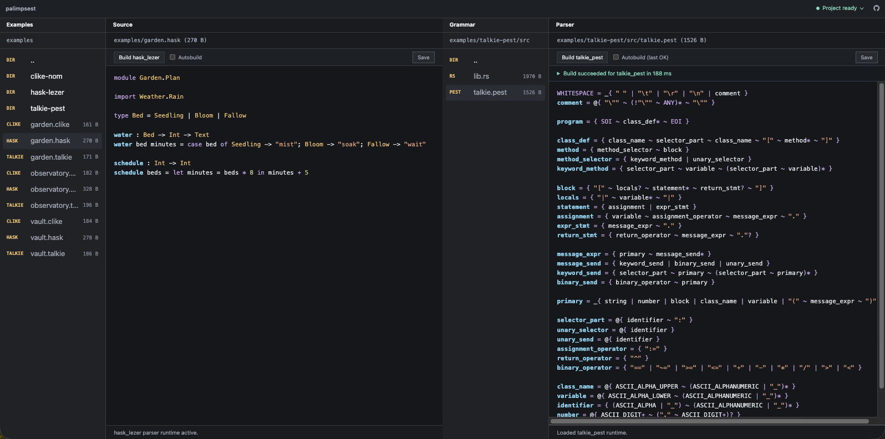

# Palimpsest

Palimpsest is a browser workbench for developing language grammars against real
project files. It opens a project configured with `palimpsest.toml`, shows two
file browser/editor panes, and can load project-specific parser runtimes for
syntax highlighting.



Features:

- Develop grammars against project files and examples.
- Keep source examples and grammar/parser code visible side by side.
- Inspect project health, configured parsers, missing build tools, and runtime
  readiness from the workbench.
- Build Rust parser runtimes from the browser with the `cargo-wasm-bindgen`
  preset.
- Build Lezer parser runtimes from the browser with the `lezer` preset.
- Review parser build commands, exit codes, stdout/stderr, elapsed time, and
  declared outputs without opening browser developer tools.
- Connect parser/highlighting runtimes through a small JSON token interface,
  with included Nom, Pest, and Lezer examples.
- Use fallback highlighting for common source and grammar files.

## Requirements

To run the workbench itself, install:

- Python 3.13 or newer.
- `uv`, for installing and running the Python command.

The bundled examples also include Rust parser runtimes that compile to
WebAssembly. To build those runtimes from the Palimpsest UI, install:

- Rust and Cargo.
- The `wasm32-unknown-unknown` Rust target.
- `wasm-bindgen-cli`.

One-time setup for the Rust/WASM tools:

```sh
rustup target add wasm32-unknown-unknown
cargo install wasm-bindgen-cli
```

The Lezer example uses JavaScript parser tooling. To build it from the
Palimpsest UI, install Node.js and install the repository's npm dependencies:

```sh
npm install
```

Palimpsest can still open configured example files before those parser runtimes
are built. Until the matching runtime loads, the custom-language examples render
with the plain-text fallback; parser-backed highlighting begins after a
successful build.

## Run

Install the command from a local checkout:

```sh
uv tool install --editable .
```

Then run the included demo from this repository:

```sh
uv run palimpsest
```

Open `http://127.0.0.1:5000`.

Palimpsest is intended to run as a trusted local development tool. It can edit
files under the configured project directory and can run parser build commands
declared in `palimpsest.toml`. The default host is local-only; if you bind to a
non-local address, treat the workbench as access to your project files and build
environment.

The repository root contains `palimpsest.toml`, so running Palimpsest here opens
the canonical example workspace in `./examples`. Open a configured grammar or
parser file in the right pane and use its build button to compile the matching
parser runtime. After the build succeeds, `.clike`, `.hask`, and `.talkie` files
switch from the plain-text fallback to parser-backed highlighting.

You can also run an external project that contains `palimpsest.toml`:

```sh
cd ../example-language
palimpsest
```

During Palimpsest development, useful command forms are:

```sh
uv run palimpsest
uv run palimpsest ../example-language
uv run palimpsest --config ../example-language/palimpsest.toml
```

## Examples

The in-repo examples are the canonical demo and smoke-test workspace. They keep
runtime configuration, parser code, and sample source files under `./examples`
so the app can browse the same tree it serves as examples.

Sample files:

- `examples/observatory.clike`, `examples/garden.clike`, and
  `examples/vault.clike` use the C-like demo language.
- `examples/observatory.hask`, `examples/garden.hask`, and
  `examples/vault.hask` use a Haskell-inspired demo language through Lezer.
- `examples/observatory.talkie`, `examples/garden.talkie`, and
  `examples/vault.talkie` use Talkie, a Smalltalk-inspired demo language.

Parser runtimes:

- `examples/clike-nom/` implements the `.clike` runtime with Nom.
- `examples/hask-lezer/` implements the `.hask` runtime with Lezer.
- `examples/talkie-pest/` implements the `.talkie` runtime with Pest.

The root `palimpsest.toml` maps `*.clike` to `clike_nom`, `*.hask` to
`hask_lezer`, and `*.talkie` to `talkie_pest`, so each parser can be seen
independently in the workbench.

## Project Configuration

A project config declares example files, parser runtimes, and the filetypes
that should use those parsers.

```toml
examples_dir = "./examples"

[capture_maps.my_language]
function = "function"
symbol = "variable"
string = "string"
number = "number"
keyword = "keyword"

[[parsers.my_language]]
adapter = "pest"
grammar_files = ["./crates/parser/src/*.pest"]
highlight_captures = "my_language"

[parsers.my_language.build]
preset = "cargo-wasm-bindgen"
package = "parser"

[parsers.my_language.runtime]
parse_export = "parse_to_json"

[[filetypes.my_language]]
extensions = ["*.my"]
parser = "my_language"
```

`grammar_files` accepts files, directories, and glob patterns, including
recursive patterns such as `./crates/parser/**/*.pest`. Grammar files show build
controls when their parser has a configured build command.

The `cargo-wasm-bindgen` build preset expands to:

```sh
cargo build -p parser --target wasm32-unknown-unknown
wasm-bindgen --target web --out-dir target/palimpsest/my_language --out-name parser target/wasm32-unknown-unknown/debug/parser.wasm
```

It also derives `build.outputs` and `runtime.module` when they are omitted.
Use `build.command` only for custom build flows that do not fit the preset.

`runtime.module` points at the browser-loadable JavaScript module produced by
`wasm-bindgen --target web`. The module should export the parser function named
by `parse_export`. Palimpsest calls that function with source text and expects a
JSON string:

```json
{
  "ok": true,
  "tokens": []
}
```

or:

```json
{
  "ok": false,
  "error": "parse failed"
}
```

The Rust crate in `crates/palimpsest` provides the shared token schema, Pest span
helpers, and byte-range token helpers for parser runtimes.

For Lezer grammars, use the `lezer` preset:

```toml
[[parsers.my_lezer_language]]
adapter = "lezer"
grammar_files = ["./src/my-language.grammar"]
highlight_captures = "my_language"

[parsers.my_lezer_language.build]
preset = "lezer"

[parsers.my_lezer_language.runtime]
parse_export = "parser"
```

The preset runs `lezer-generator`, bundles the generated parser with `esbuild`,
and derives `runtime.module` as `target/palimpsest/<parser>/parser.js`. The
runtime export should be the Lezer parser object; Palimpsest walks its syntax
tree and emits tokens for node names present in the configured capture map.

## Highlighting

Parser runtimes emit logical captures such as `keyword`, `string`,
`function`, or `capture.variable`. `capture_maps` translate those captures to
Palimpsest token classes. Dotted capture names become dash-separated CSS
classes; for example, `punctuation.delimiter` becomes
`tok-punctuation-delimiter`.

Configured filetypes inherit their parser's resolved capture map by default.
Use filetype-level capture maps only when a filetype needs different styling
from its parser.

Files without a loaded parser runtime use the fallback highlighter registry.
That registry covers common source formats through Highlight.js and keeps local
tokenizers for grammar-oriented formats such as Pest, Lezer, Tree-sitter
grammar files, and plain text.

## Workbench Behavior

The UI has two file browser/editor pairs. The left `Examples / Source` pane
starts at `examples_dir`. The right `Grammar / Parser` pane starts near the
first configured grammar file and opens that file when available.

Both panes share the same browsing, editing, mode detection, and highlighting
behavior. Files with configured filetypes switch from their detected fallback
highlighter, often plain text for project-specific extensions, to parser-runtime
highlighting once their parser module is available.

At startup, Palimpsest imports configured runtime modules that already exist. If
a runtime has not been built yet, the filetype remains usable with the detected
fallback highlighter until the parser build succeeds.

The header health panel reports the loaded config, workspace path, dependency
checks for configured build presets, parser readiness, and missing runtime
outputs. Build controls appear on configured grammar/parser files. Build results
show the command, working directory, exit code, elapsed time, output files, and
stdout/stderr. Autobuild is debounced and Palimpsest prevents duplicate builds
for the same parser.

If a pane has unsaved changes, Palimpsest warns before opening another file,
opening another directory, or closing the page.

## Development Checks

Run the Python tests:

```sh
uv run python -m unittest
```

Run the browser-side JavaScript tests:

```sh
npm test
```

Run the Rust crate and example parser tests:

```sh
cargo test --workspace
```

For a local smoke check, run the app against this repository and open the
default URL:

```sh
uv run palimpsest
```

## Code Layout

- `palimpsest/config.py` loads and validates `palimpsest.toml`.
- `palimpsest/models.py` defines typed API response models.
- `palimpsest/api.py` serves app state, directory listings, grammar discovery,
  and file content.
- `palimpsest/ui.py` serves the HTML shell.
- `palimpsest/static/js/app.mjs` bootstraps the browser workbench.
- `palimpsest/static/js/core/` contains signal and registry primitives.
- `palimpsest/static/js/highlight/` contains Highlight.js integration and local
  fallback tokenizers.
- `palimpsest/static/js/modes/` contains major-mode and compiler wiring.
- `palimpsest/static/js/parser_runtimes.mjs` registers and loads configured
  parser runtimes.
- `palimpsest/static/js/workspace.mjs` defines the reusable browser/editor
  custom element.
- `examples/` contains the canonical demo files and example parser runtimes.
